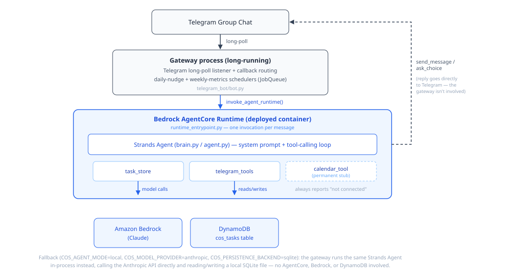

# CoS — Household Chief of Staff (Telegram + Strands) — Design Spec

Original design spec, written before implementation began. It covers the intended architecture, tools, data model, and system prompt. Some of this changed once real building and live-testing started — see [`README.md`](README.md)'s "Design deviations" table for what actually shipped and why.

---

## 1. Product Summary

CoS is a Telegram bot, powered by AWS Strands Agents, that lives in a shared chat between two partners. It reduces "mental load" by:
1. Turning messy natural-language mentions of tasks into structured, dated items (**capture**)
2. Assigning explicit ownership and doing the follow-up nagging itself, not the person (**delegation**)
3. Surfacing who is holding how much open work, on a recurring basis (**visibility**)

MVP scope is a single household/couple, single Telegram group chat, no multi-tenant admin panel.

---

## 2. System Architecture

```
Telegram Group Chat
        │
        ▼
strands-telegram-listener  (long-polling, catches incoming messages)
        │
        ▼
Strands Agent (single agent, Week 1–2 scope)
   ├── Model: Claude via Amazon Bedrock
   ├── System prompt: see §5
   └── Tools (see §4):
        ├── task_store        (create/update/query tasks)
        ├── calendar_tool     (Google Calendar read/write)
        ├── digest_generator  (compiles weekly summary)
        └── strands-telegram  (send messages, inline keyboards, mentions)
        │
        ▼
Persistence: Google Sheets — tasks table
        │
        ▼
Scheduler: EventBridge (or cron if running on a single EC2/Fargate task)
        — triggers: due-date check (daily), weekly digest (Sunday)
```

**Deployment path for MVP:** run as a single long-running process (Fargate task or EC2 instance) with the telegram-listener running continuously. Avoid Lambda for the listener itself (long polling doesn't fit Lambda's execution model well); Lambda + EventBridge is fine for the daily/weekly scheduled digest and reminder checks if you want to split those out later.

**Why single-agent for MVP, not multi-agent:** the multi-agent split (capture agent / planner agent) adds real value later, but for a 3-week MVP one agent with well-scoped tools and a clear system prompt is faster to build, easier to debug, and sufficient to validate the concept. Revisit multi-agent once the single-agent version proves the loop works.

---

## 3. Data Model

**`tasks` table**

| Field | Type | Notes |
|---|---|---|
| `task_id` | string (PK) | UUID |
| `chat_id` | string | Telegram group chat ID (multi-household ready later) |
| `title` | string | e.g. "Buy soccer shoes for Mia" |
| `category` | enum | `errand`, `admin`, `gift`, `appointment`, `recurring`, `other` |
| `created_by` | string | Telegram user id |
| `owner` | string \| null | Telegram user id currently responsible; null = unassigned |
| `due_date` | date \| null | nullable — many mental-load items have soft/no deadlines |
| `status` | enum | `open`, `in_progress`, `done`, `snoozed` |
| `recurrence` | string \| null | e.g. `"annual:2026-09-01"` for season-based reminders |
| `source_message` | string | original raw text, for traceability |
| `created_at` / `updated_at` | timestamp | |
| `last_nudge_at` | timestamp \| null | prevents nag spam |

**`digest_log` table** (optional, for tracking whether digests reduce imbalance over time — not implemented; see README)

| Field | Type |
|---|---|
| `week_of` | date |
| `chat_id` | string |
| `open_count_by_owner` | JSON map |
| `sent_at` | timestamp |

---

## 4. Tools

Keep the toolset small and single-purpose — this is what keeps agent behavior predictable.

### 4.1 `task_store`
Custom tool (write this one yourself, not off-the-shelf). Actions:
- `create_task(title, category, due_date, owner, recurrence, source_message)`
- `update_task(task_id, fields)`
- `get_open_tasks(chat_id, owner=None)`
- `mark_done(task_id)`
- `get_overdue_tasks(chat_id)`

### 4.2 `calendar_tool`
Google Calendar API wrapper (custom, or check if a community Strands tool exists at build time). Actions:
- `check_upcoming_events(date_range)` — used to cross-reference seasonal/recurring tasks (e.g. "soccer season starts")
- `create_event(title, date)` — optional, only if you want tasks to also land on a shared calendar

### 4.3 `digest_generator` (not implemented — see README)
Custom tool. Pulls from `task_store`, groups by owner, formats a summary string. Keep formatting logic in the tool, not the prompt, so output is consistent.

### 4.4 `strands-telegram` (community package)
For sending: `send_message`, inline keyboards (`send_message` with `inline_keyboard` param), user mentions, `send_poll` if useful for the "who takes this" decision.

### 4.5 `strands-telegram-listener` (community package)
For receiving: long-polls the chat, passes new messages into the agent loop. Note it's community-maintained — review the source before relying on it in production, and pin a specific version.

---

## 5. System Prompt (draft)

This is the single-agent MVP prompt. Tune tone once you see real usage.

```
You are CoS, an assistant living in a shared household Telegram chat between two partners. Your job is to reduce the invisible mental load of tracking household and family tasks — not just reminding one person, but making tasks visible to both partners and helping split ownership fairly.

Core behaviors:

1. CAPTURE
When someone mentions something that needs doing — an errand, appointment, form, purchase, seasonal task — extract it into a structured task using the task_store tool. Do this even if the message wasn't phrased as a request to you; you are always listening for task-shaped mentions in the chat.
- If a due date is stated or clearly implied, include it. If not, leave due_date null — do not invent a deadline.
- If a recurring/seasonal pattern is implied ("before soccer starts again"), check the calendar_tool for relevant upcoming dates and set recurrence if appropriate.
- Always confirm what you captured in one short message, and ask who should own it if not stated. Offer the choice as a follow-up question, not an assumption — do not default to the person who mentioned it.

2. DELEGATION
When ownership is unclear, ask explicitly who is taking it, using an inline keyboard with 2-3 options (e.g. "I'll take it" / "assign to [partner]" / "split — let's talk"). Once assigned, you own the follow-up: the person who mentioned the task should never have to follow up themselves. That follow-up responsibility transferring to you is the entire point of this system.

3. FOLLOW-UP
Check overdue and upcoming tasks daily. For tasks nearing their due date or overdue, message the owner directly (not the whole chat, unless it's the weekly digest) with a light nudge and a one-tap "done" button. Do not nudge more than once per day for the same task (check last_nudge_at).

4. VISIBILITY / WEEKLY DIGEST
Once a week, post a summary in the shared chat of all open tasks grouped by owner, including how long items have been open. State the count per person plainly. If one partner is holding meaningfully more open tasks than the other, note it neutrally — do not editorialize or assign blame, just surface the imbalance and offer a "rebalance" action.

Tone:
- Be brief. This is Telegram, not email — one to three short lines per message, no preamble.
- Be neutral and non-judgmental, especially around imbalance — the goal is visibility, not guilt.
- Never assume gender roles or who "should" do a task. Always ask.
- Prefer buttons/inline keyboards over asking the user to type free text when the response is a clear choice.
- If a message doesn't contain anything task-shaped, don't force a task out of it — just don't respond, or respond conversationally if directly addressed.

Constraints:
- Only act on tasks in this chat's own task list (scoped by chat_id).
- Never delete a task; mark it done or snoozed instead.
- If you're unsure whether something is a real task or just conversation, ask rather than guessing.
```

---

## 6. Message Flow Examples 

**Capture flow**
1. User posts free-text message in group
2. Listener passes message + chat_id + sender_id to agent
3. Agent decides: task-shaped or not
4. If yes → `task_store.create_task(...)` → `strands-telegram.send_message` with confirmation + ownership inline keyboard
5. Callback query (button tap) routes back into agent → `task_store.update_task(owner=...)`

**Daily nudge flow (scheduled)**
1. Scheduler triggers agent with a synthetic instruction: "run daily task check for chat_id X"
2. Agent calls `task_store.get_overdue_tasks` + upcoming due-soon tasks
3. For each, checks `last_nudge_at`, sends nudge if eligible, updates `last_nudge_at`

**Weekly digest flow (scheduled)** — not implemented; replaced by the weekly stats summary, see README
1. Scheduler triggers agent: "run weekly digest for chat_id X"
2. Agent calls `task_store.get_open_tasks` grouped by owner
3. Agent calls `digest_generator` to format
4. Sends to group chat, logs to `digest_log`

---

## 7. Build Order (maps to the 3-week plan)

**Week 1**
- Stand up Strands agent + Bedrock model connection
- Build `task_store` tool + Google Sheet table
- Wire `strands-telegram-listener` + `strands-telegram` for basic capture → confirm loop
- No scheduling yet; test capture flow manually in a test group chat

**Week 2**
- Add `calendar_tool` for seasonal/recurring detection
- Add ownership/delegation inline keyboards + callback handling
- Add daily nudge scheduler (EventBridge or simple cron)
- Add `digest_generator` + weekly digest scheduler

**Week 3**
- Polish prompt tone based on real test-chat usage
- Add basic metrics logging (tasks captured, resolved without follow-up from the original reporter, delegation acceptance rate)
- Run with 3-5 real test households in their own group chats
- Fix extraction/ownership-assignment edge cases surfaced by real usage

Actual build order and scope diverged from this plan in places (e.g. the weekly digest was cut, metrics logging was redefined) — see README's "Status" and "Design deviations" sections for what actually shipped.

---

## 8. Hackathon Target Architecture (Bedrock + AgentCore)

CoS is being entered in AWS's **Agents for Humans Hackathon** (Everyday Agents track). This is a planned architecture change, not yet built — it moves the two remaining spec deviations (direct Anthropic API instead of Bedrock, and no AgentCore deployment) back in line with the original design, and adds real AWS depth beyond what §2 called for.

**Key constraint that shapes this:** Amazon Bedrock AgentCore Runtime is a synchronous request/response HTTP service — it has no native support for a long-polling listener or scheduled background jobs. CoS's Telegram polling loop and its two daily `JobQueue` jobs (nudge, weekly metrics) can't move into AgentCore as-is, so the system splits into a **gateway** and a **brain**:



*Today, the gateway calls a Strands Agent running in-process against the Anthropic API and local SQLite. The hackathon target keeps the same gateway, but routes that call through Amazon Bedrock AgentCore Runtime instead — the container hosts the Strands Agent ("brain") wrapped via `BedrockAgentCoreApp` / `@app.entrypoint`, using the same tools (`task_store`, `telegram_tools`, `calendar_tool`) and system prompt (§5) as today, backed by Amazon Bedrock and DynamoDB instead of the Anthropic API and local SQLite.*

Consequences for the existing implementation:
- The gateway (Telegram polling + scheduling) is unchanged — it just calls the deployed AgentCore endpoint per message/job instead of building a local `Agent` object.
- `task_store.py`'s persistence moves from SQLite to DynamoDB, keeping the same tool function signatures (`create_task`, `update_task`, `get_open_tasks`, `mark_done`, `get_weekly_metrics`, …) so `agent.py`/`prompts.py` don't need to change.
- A local-mode fallback (direct Bedrock call, no AgentCore round-trip) stays available behind a config flag, for fast dev iteration without a full container rebuild each time.

Build order for this work: (1) swap `AnthropicModel` → `BedrockModel` in `agent.py` first, verified live, before (2) the gateway/brain split, DynamoDB migration, and AgentCore Runtime deployment. See README's "Status" section for current progress against this once the work starts.

---

*The open decisions originally flagged here (scheduler mechanism, Telegram community-package risk, multi-user identity) were all resolved during implementation — see README.md's "Design deviations" table.*
